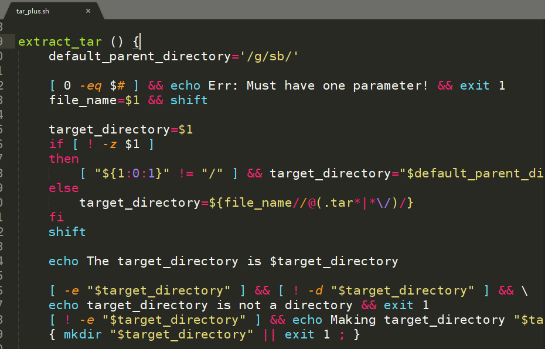

[![MIT License][license-shield]][license-url]


<br />
<p align="center">
  <a href="https://github.com/DaviesGit">
    
  </a>

  <h3 align="center">Maked by Davies</h3>

  <p align="center">
    Email: 1182176003@qq.com
<!--     <br />
    <a href="https://github.com/DaviesGit"><strong>Explore the docs »</strong></a>
    <br />
    <br />
    <a href="javascript:void(0)">View Demo</a>
    ·
    <a href="javascript:void(0)">Report Bug</a>
    ·
    <a href="javascript:void(0)">Request Feature</a> -->
  </p>
</p>


<!-- TABLE OF CONTENTS -->

## Table of Contents

* [About the Project](#about-the-project)
  * [Built With](#built-with)
* [Getting Started](#getting-started)
  * [Prerequisites](#prerequisites)
  * [Installation](#installation)
* [Usage](#usage)
* [功能定制](#功能定制)
* [Roadmap](#roadmap)
* [Contributing](#contributing)
* [License](#license)
* [Contact](#contact)
* [Acknowledgements](#acknowledgements)
* [免责声明](#免责声明)


<!-- ABOUT THE PROJECT -->
## About The Project

一些自己写的，方便平时使用的linux shell脚本。




功能:
* `build_alias.sh` 创建alias映射，对常用命令进行简化。
* `build_all_map.sh` 把软件命令映射到bin文件夹，方便从命令行调用。
* `build_path_variable.sh` 将自定义路径添加到系统path变量中。
* `generate_map.sh` 创建所有映射。
* `find_binary.sh` 找到可执行文件位置。
* `focus_terminal.sh` 配合快捷键`ctrl+shift+s`使用，可以快速定位命令窗口。
* `group_software.sh` 将软件移动到目标文件夹。
* `run_program.sh` 启动程序，让程序在后台运行，不占用terminal。
* `tar_plus.sh` tar解压命令的简化版本。


### Built With
依赖
* linux


<!-- GETTING STARTED -->
## Getting Started

这个章节将指导你简单的部署和使用该软件。

### Prerequisites

这个项目的依赖安装步骤在下面给出。
* 无


### Installation

1. Clone the repo
```sh
git clone https://github.com/path/to/the/repository
```


<!-- USAGE EXAMPLES -->
## Usage

1. 在命令行中以正确的参数调用调用。


## 功能定制

如果需要功能定制，请联系作者 [1182176003@qq.com](1182176003@qq.com)


<!-- ROADMAP -->
## Roadmap

See the [open issues](https://example.com) for a list of proposed features (and known issues).


<!-- CONTRIBUTING -->
## Contributing

Contributions are what make the open source community such an amazing place to be learn, inspire, and create. Any contributions you make are **greatly appreciated**.

1. Fork the Project
2. Create your Feature Branch (`git checkout -b feature/AmazingFeature`)
3. Commit your Changes (`git commit -m 'Add some AmazingFeature'`)
4. Push to the Branch (`git push origin feature/AmazingFeature`)
5. Open a Pull Request


<!-- LICENSE -->
## License

Distributed under the MIT License. See `LICENSE` for more information.


<!-- CONTACT -->
## Contact

Davies - [@qq](1182176003) - 1182176003

Davies - [@email](1182176003@qq.com) - 1182176003@qq.com

Project Link: [https://example.com](https://example.com)


<!-- ACKNOWLEDGEMENTS -->
## Acknowledgements
* [GitHub](https://github.com/)
* [Font Awesome](https://fontawesome.com)


## 免责声明
* 该软件中所包含的部分内容，包括文字、图片、音频、视频、软件、代码、以及网页版式设计等可能来源于网上搜集。

* 该软件提供的内容仅用于个人学习、研究或欣赏，不可使用于商业和其它意图，一切关于该软件的不正当使用行为均与我们无关，亦不承担任何法律责任。使用该软件应遵守相关法律的规定，通过使用该软件随之而来的风险与我们无关，若使用不当，后果均由个人承担。

* 该软件不提供任何形式的保证。我们不保证内容的正确性与完整性。所有与使用该软件的直接风险均由用户承担。

* 如果您认为该软件中所包含的部分内容侵犯了您的权益，请及时通知我们，我们将尽快予以修正或删除。


<!-- MARKDOWN LINKS & IMAGES -->
<!-- https://www.markdownguide.org/basic-syntax/#reference-style-links -->

[license-shield]: readme_images/MIT_license.svg
[license-url]: https://opensource.org/licenses/MIT

[product-screenshot]: readme_images/screenshot.png
